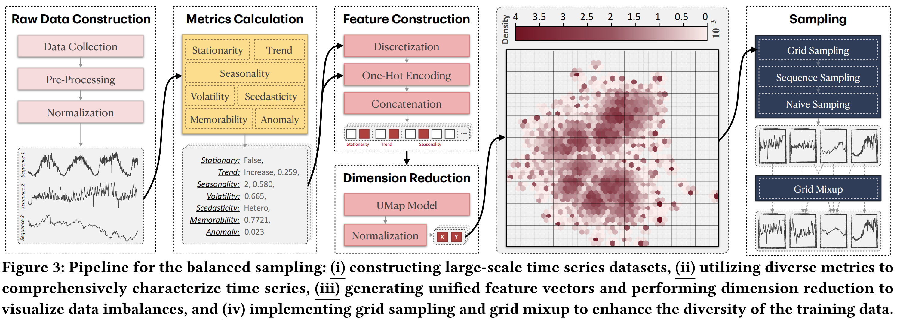

# <div align="center"> BLAST: Balanced Sampling Time Series Corpus for Universal Forecasting Models </div>

Code for our SIGKDD'25 paper: "[BLAST: Balanced Sampling Time Series Corpus for Universal Forecasting Models](https://arxiv.org/pdf/2505.17871)".



> The advent of universal time series forecasting models has revolutionized zero-shot forecasting across diverse domains, yet the critical role of data diversity in training these models remains underexplored. Existing large-scale time series datasets often suffer from inherent biases and imbalanced distributions, leading to suboptimal model performance and generalization. To address this gap, we introduce BLAST, a novel pre-training corpus designed to enhance data diversity through a balanced sampling strategy. First, BLAST incorporates 321 billion observations from publicly available datasets and employs a comprehensive suite of statistical metrics to characterize time series patterns. Then, to facilitate pattern-oriented sampling, the data is implicitly clustered using grid-based partitioning. Furthermore, by integrating grid sampling and grid mixup techniques, BLAST ensures a balanced and representative coverage of diverse patterns. Experimental results demonstrate that models pre-trained on BLAST achieve state-of-the-art performance with a fraction of the computational resources and training tokens required by existing methods. Our findings highlight the pivotal role of data diversity in improving both training efficiency and model performance for the universal forecasting task.

---

> [!IMPORTANT]
> This repository contains the code to ***generate*** the BLAST corpus. 
> 
> If you are interested in ***using*** the BLAST corpus to train universal forecasting models, please refer to the [BasicTS](https://github.com/GestaltCogTeam/BasicTS) repository. It provides native support for BLAST and can be used to train models such as TimeMoE (decoder-only architecture) and ChronosBolt (encoder-decoder architecture).

The folders `raw_data_construction`, `metrics_calculation`, `feature_construction`, `dimension_reduction`, and `sampling` correspond to the sections shown in the diagram above. The raw BLAST data contains 321 billion observations, approximately 3.4TB in size. After sampling, BLAST includes 3 million time series, each with a maximum length of 4096, and is approximately 227GB in size. These data will be open-sourced on HuggingFace after the review process. `TimeMoE_BLAST` contains the code to train the TimeMoE model on the BLAST corpus.

## 💿 Requirements

This code is built on Python 3.11. The required packages can be installed using the following command:

```bash
pip install -r requirements.txt
```

## 📂 Prepare Raw Data

Download the data from [Chronos](https://github.com/amazon-science/chronos-forecasting), [MOIRAI](https://github.com/SalesforceAIResearch/uni2ts), and [MOMENT](https://github.com/moment-timeseries-foundation-model/moment), and place it in the `datasets/raw_datasets/` folder.

The directory becomes:

```
datasets/raw_datasets/
├── chronos_datasets
│   ├── dominick
│   └── electricity_15min
|   └── ...
├── lotsa_datasets
│   ├── alibaba_cluster_trace_2018
│   └── australian_electricity_demand
│   └── ...
├── Timeseries-PILE
│   ├── anomaly_detection
│   ├── classification
│   ├── forecasting
```


## BLAST Workflow

### 1. Raw Data Construction

Read raw data from various sources and save them in a unified format

```bash
python raw_data_construction/Chronos_read_and_save.py
python raw_data_construction/LOTSA_read_and_save.py
python raw_data_construction/Monash_read_and_save.py
python raw_data_construction/UCR_read_and_save.py
python raw_data_construction/UAD_read_and_save.py
```

The processed data will be saved in the `datasets/processed_datasets/` folder.

### 2. Metrics Calculation

```bash
python metrics_calculation/main.py
```

The results will be saved in the `metrics_calculation/output/` folder.

### 3. Feature Construction

```bash
python feature_construction/main.py
```

The results will be saved in the `feature_construction/output/` folder.

### 4. Dimension Reduction

First, run `dimension_reduction_train.py` to train the UMAP model.

Then, run `dimension_reduction,py` to reduce the dimensions of the features.


### 5. Sampling

1. run `sampling/sampling.py`

2. run `sampling/split.py`

3. run `sampling/clean_data.ipynb`

The sampled data will be saved in the `sampling/train` and `sampling/valid` folders.


## TODO
- [ ] Clean up the code and add comments.
